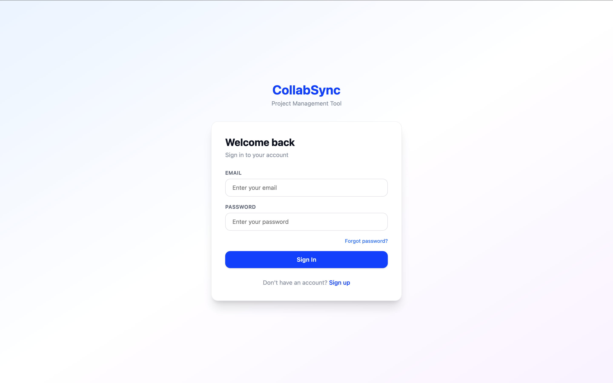
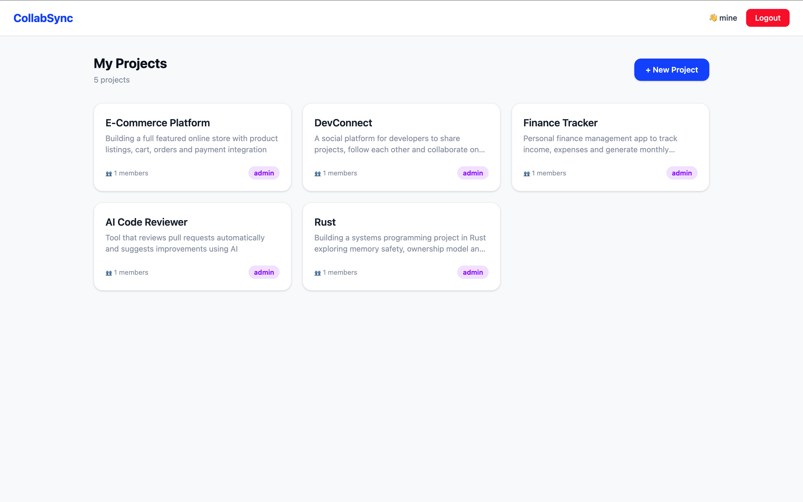
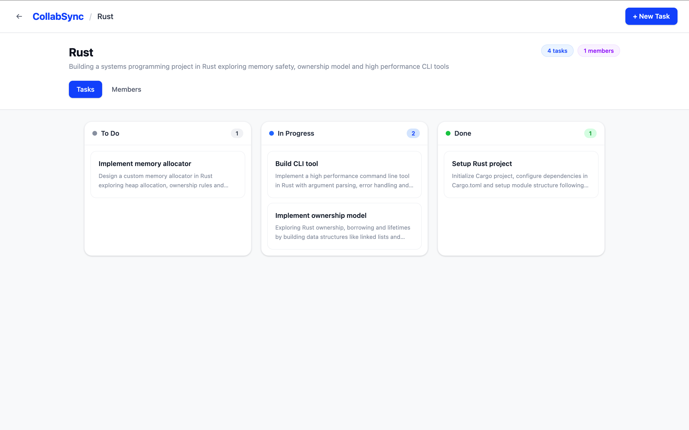
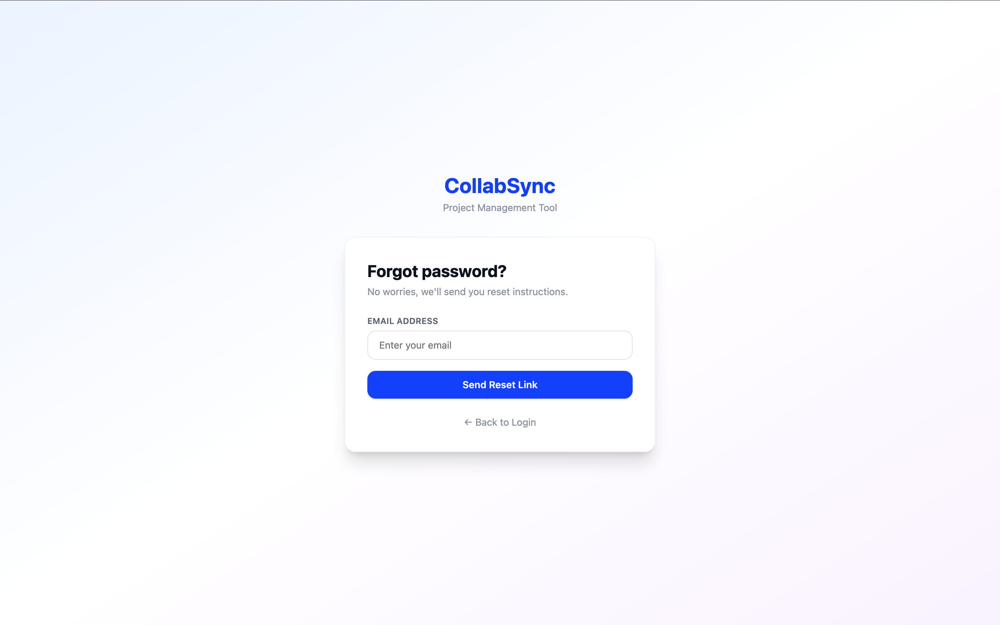

<div align="center">

# 🚀 CollabSync

### A fullstack project management tool for teams

[](https://nodejs.org)
[](https://expressjs.com)
[](https://mongodb.com)
[](https://react.dev)
[](https://tailwindcss.com)

</div>

---

## 📸 Screenshots

> Login Page


> Dashboard


> Kanban Board


> Forgot Password


---

## ✨ Features

- 🔐 JWT Authentication with email verification & password reset
- 📁 Create and manage projects
- ✅ Kanban board — Todo / In Progress / Done
- 👥 Team management with role-based access control
- 📎 File attachments on tasks
- 🧩 Subtask support

---

## 🛠 Tech Stack

| Layer | Tech |
|---|---|
| Frontend | React 19, Tailwind CSS v4, Vite |
| Backend | Node.js, Express v5 |
| Database | MongoDB, Mongoose |
| Auth | JWT, Bcrypt |
| Email | Nodemailer, Mailgen, Mailtrap |
| Uploads | Multer |

---

## 🚀 Getting Started

### 1. Clone the repo
```bash
git clone https://github.com/pankajsinghhh/collabsync.git
cd collabsync
```

### 2. Create `.env` file in root
```env
PORT=8000
MONGO_URI=your_mongodb_uri
ACCESS_TOKEN_SECRET=your_secret
ACCESS_TOKEN_EXPIRY=1d
REFRESH_TOKEN_SECRET=your_secret
REFRESH_TOKEN_EXPIRY=7d
CORS_ORIGIN=http://localhost:5173
FORGOT_PASSWORD_REDIRECT_URL=http://localhost:5173/reset-password
MAILTRAP_SMTP_HOST=sandbox.smtp.mailtrap.io
MAILTRAP_SMTP_PORT=2525
MAILTRAP_SMTP_USER=your_user
MAILTRAP_SMTP_PASS=your_pass
SERVER_URL=http://localhost:8000
```

### 3. Run backend
```bash
npm install
npm run dev
```

### 4. Run frontend
```bash
cd client
npm install
npm run dev
```

### 5. Open in browser
```
Frontend → http://localhost:5173
Backend  → http://localhost:8000/api/v1/healthcheck
```

---

<div align="center">

Built  by **Pankaj Singh**

⭐ Star this repo if you found it helpful!

</div>